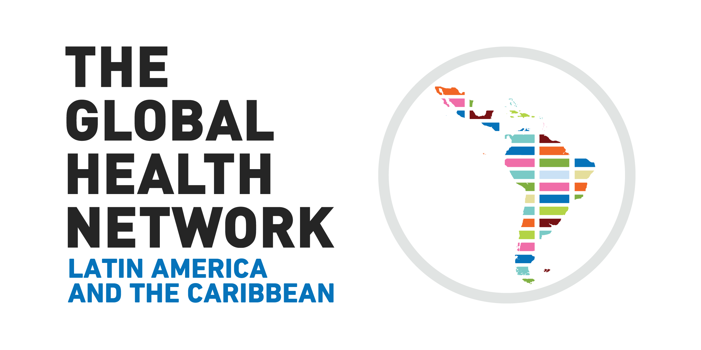
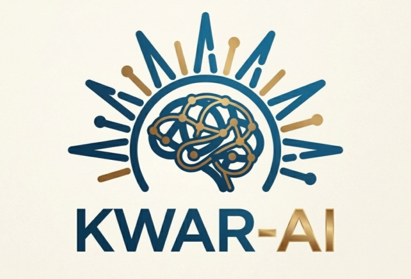

## Scientific Committee

- **Flávio Codeço Coelho** *(Chair of the Scientific Committee)*  
  Applied Mathematics School, Getulio Vargas Foundation, Brazil

- **Cláudia Torres Codeço** *(Chair of the Scientific Committee)*  
  Oswaldo Cruz Foundation, Scientific Computing Program, Brazil

- **Luiz Max Carvalho**  
  Applied Mathematics School, Getulio Vargas Foundation, Brazil

- **Leonardo Bastos**  
  Oswaldo Cruz Foundation, Scientific Computing Program, Brazil

- **Marcela Lopes Santos**  
  Ministry of Health of Brazil

- **Mattia Mazzoli**  
  ISI Foundation, Italy

- **Rachel Lowe**  
  Barcelona Supercomputing Center, Barcelona, Spain

- **Raquel Martins Lana**  
  Barcelona Supercomputing Center, Spain

## Organizing Committee

- **Fabiana Sherine Ganem dos Santos** *(Chair of the Organizing Committee)*  
  Applied Mathematics School, Getulio Vargas Foundation, Brazil

- **Eduardo Correa Araujo**  
  Applied Mathematics School, Getulio Vargas Foundation, Brazil

- **Luã Bida Vacaro**  
  Applied Mathematics School, Getulio Vargas Foundation, Brazil

- **Iasmim Ferreira de Almeida**  
  Applied Mathematics School, Getulio Vargas Foundation, Brazil

## Support:

  
  

